**Analyse en Composantes Principales (PCA)**

**MNIST** — 70 000 images de chiffres manuscrits (0 à 9) de 28×28 pixels, aux formes régulières et à faible variabilité de trait ; et **QuickDraw** — un extrait de croquis dessinés à la main (catégories *cat*, *apple*, *car*), également en 28×28 pixels, mais aux contours beaucoup plus irréguliers et aux traits fins.

Pour chacun des deux jeux de données, un même modèle PCA a été entraîné sur les images aplaties en vecteurs de 784 (28X28) valeurs (pixels/features), puis exploité pour nos trois usages complémentaires : **(1) la réduction de dimension**, **(2) la compression / décompression** et **(3) la génération d'images**. Chaque section ci-dessous explique le principe de la tâche, puis présente et compare les visualisations produites sur les deux jeux de données, MNIST à gauche et QuickDraw à droite.
1. # **Introduction — Qu'est-ce que la PCA ?**
   La PCA : principe et déroulé

   La PCA (Analyse en Composantes Principales) est une méthode statistique linéaire et non supervisée de réduction de dimension. Elle prend un ensemble de données à d dimensions — ici les 28 × 28 = 784 pixels d'une image — et cherche un nouveau système d'axes orthogonaux, appelés composantes principales, qui concentre le maximum de variance (d'information) dans le moins d'axes possible. Elle n'utilise à aucun moment les étiquettes de classe : celles-ci ne servent, dans ce rapport, qu'à colorier les visualisations et à évaluer les résultats a posteriori.

   Notations — N est le nombre d'images du jeu d'ajustement, d = 784 la dimension d'une image aplatie(ou son nombre de pixels), k le nombre de composantes conservées (k ≤ 784).

   Les étapes de l'algorithme pour des images

   1\. Vectorisation — x = vec(I), avec I ∈ ℝ^(28×28) → x ∈ ℝ^784

   Chaque image, initialement une matrice carrée de 28 lignes et 28 colonnes, est aplatie en un unique vecteur colonne de 784 composantes (lecture ligne par ligne). Une image devient ainsi un point dans un espace à 784 dimensions. L'empilement des N images forme la matrice de données X ∈ ℝ^(N×784) : une ligne par image, une colonne par pixel.

x = vec(I)                (28 × 28)  ->  (784 × 1)
X = [x₁ᵀ ; … ; x\_Nᵀ]                      (N × 784)

2\. Centrage — μ = (1/N) · Σᵢ xᵢ, puis X\_c = X − 1·μᵀ

On calcule l'image moyenne μ ∈ ℝ^784 (le centre de gravité du nuage de points), qui est elle-même une image 28 × 28 une fois remise en forme. On la soustrait à chaque image : le nuage est alors centré sur l'origine. Cette étape est indispensable, mais la façon de centrer n'est pas neutre — deux conventions existent, et elles ne donnent pas le même modèle.

2a. Centrage par colonne (par pixel) — la convention correcte

μⱼ = (1/N) · Σᵢ X[i,j] pour chaque pixel j = 1 … 784, soit μ ∈ ℝ^784

X\_c = X − 1·μᵀ

Chaque pixel possède sa propre moyenne, calculée sur les N images. On soustrait donc 784 valeurs différentes, une par colonne de X. Le vecteur μ, remis en forme, est l'image moyenne visible en figure 13 (à gauche) : un « 8 » fantomatique flou pour MNIST, une silhouette ronde pour QuickDraw. Après cette opération, chaque colonne de X\_c est de moyenne nulle, et C = (1/(N−1))·X\_cᵀX\_c est alors la véritable matrice de covariance des données.

μᵀ  = (1/N) · 1\_Nᵀ · X     (1 × N)·(N × 784)              = (1 × 784)    
X\_c = X − 1\_N · μᵀ         (N × 784) − (N × 1)·(1 × 784)  = (N × 784)    
μᵀ. X\_c conserve exactement la taille de X.

2b. Centrage global — la convention piégeuse

m = (1/(N·784)) · Σᵢ Σⱼ X[i,j], soit m ∈ ℝ (un seul scalaire)

X\_c = X − m·1·1ᵀ

On soustrait ici la même valeur à tous les pixels de toutes les images : une simple constante, le niveau de gris moyen de tout le jeu de données. C'est un décalage uniforme de luminosité, pas un recentrage du nuage. Les colonnes de X\_c ne sont pas de moyenne nulle : la structure de l'image moyenne survit intégralement dans les données.

m   = (1/(N·784)) · Σᵢ Σⱼ X[i,j]                          = scalaire     
X\_c = X − m · J            (N × 784) − (N × 784)          = (N × 784)    
où J ∈ ℝ^(N×784) est la matrice entièrement remplie de 1.
Coefficient par coefficient :  X\_c[i,j] = X[i,j] − m

3\. Matrice de covariance — C = (1/(N−1)) · X\_cᵀ X\_c, avec C ∈ ℝ^(784×784)

On mesure comment les 784 pixels varient conjointement. Le terme C[i,j] indique si les pixels i et j s'allument ensemble. La diagonale contient la variance de chaque pixel. La matrice est carrée, symétrique et de taille 784 × 784, indépendamment du nombre d'images.

C = (1/(N−1)) · X\_cᵀ · X\_c   (784 × N)·(N × 784)          = (784 × 784)  

4\. Diagonalisation — C = U Λ Uᵀ, avec C uⱼ = λⱼ uⱼ et λ₁ ≥ λ₂ ≥ … ≥ λ₇₈₄ ≥ 0

C'est le cœur de la méthode. Comme C est symétrique réelle, elle est diagonalisable en base orthonormée. On obtient 784 vecteurs propres uⱼ ∈ ℝ^784 — les composantes principales — et 784 valeurs propres λⱼ que l'on trie par ordre décroissant. Chaque λⱼ est exactement la variance des données le long de l'axe uⱼ. Chaque vecteur propre, remis en forme 28 × 28, est visualisable comme une image : c'est une eigen-image. La base est orthonormée : uᵢᵀuⱼ = 0 si i ≠ j, et ‖uⱼ‖ = 1.

C = U · Λ · Uᵀ           (784×784)·(784×784)·(784×784)    = (784 × 784)  
C · uⱼ = λⱼ · uⱼ         (784 × 784)·(784 × 1)            = (784 × 1)    
uⱼ  ->  reshape          (784 × 1)  ->  (28 × 28)           [eigen-image]

5\. Choix du nombre de composantes — ratio(j) = λⱼ / Σₗ λₗ, puis W\_k = [u₁ u₂ … u\_k] ∈ ℝ^(784×k)

On ne garde que les k premiers vecteurs propres, ceux qui portent le plus de variance. Le ratio de variance expliquée et sa somme cumulée guident le choix de k (courbes du scree plot). On assemble ces k vecteurs en colonnes dans une matrice de projection W\_k, de taille 784 × k, qui vérifie W\_kᵀ W\_k = I\_k.

W\_k = [u₁ … u\_k]                                          = (784 × k)
W\_kᵀ · W\_k               (k × 784)·(784 × k) = (k × k)    = I\_k          
W\_k · W\_kᵀ               (784 × k)·(k × 784) = (784 × 784)  ≠ identité
attention à l'ordre. W\_kᵀ W\_k vaut bien l'identité I\_k (base
orthonormée), mais W\_k W\_kᵀ est le projecteur orthogonal de rang k — c'est
précisément là que réside la perte d'information.

6\. Encodage (projection) — z = W\_kᵀ (x − μ), avec z ∈ ℝ^k

Chaque image centrée est projetée sur les k axes retenus. Le vecteur z est le code latent : ses coordonnées zⱼ indiquent « combien » de chaque eigen-image compose l'image. On passe de 784 nombres à seulement k nombres.

z = W\_kᵀ · (x − μ)       (k × 784)·(784 × 1)              = (k × 1)      
Z = X\_c · W\_k            (N × 784)·(784 × k)              = (N × k)        [tout le jeu]
784 -> k.  C'est l'étape de compression.

7\. Décodage (reconstruction) — x̂ = μ + W\_k z = μ + Σⱼ₌₁..k zⱼ · uⱼ, avec x̂ ∈ ℝ^784

Opération inverse : on repart de l'image moyenne et on lui ajoute une combinaison linéaire des eigen-images, pondérées par le code latent. Le résultat, remis en forme 28 × 28, est l'image reconstruite. Si k = 784, la reconstruction est exacte ; si k < 784, elle est approchée.

x̂ = μ + W\_k · z          (784 × 1) + (784 × k)·(k × 1)    = (784 × 1)    
X̂ = 1\_N · μᵀ + Z · W\_kᵀ  (N×1)·(1×784) + (N×k)·(k×784)    = (N × 784)    
x̂  ->  reshape           (784 × 1)  ->  (28 × 28)
Contrôle : k -> 784. On retrouve exactement 784 valeurs, donc une image complète —
aucun pixel n'est perdu. Ce qui est perdu, ce sont les degrés de liberté : ces 784
nombres ne sont déterminés que par les k coefficients de z.

8\. Erreur de reconstruction — MSE = (1/784)·‖x − x̂‖², et en moyenne : E[‖x − x̂‖²] = Σⱼ₌ₖ₊₁..₇₈₄ λⱼ

L'information perdue est exactement la somme des valeurs propres écartées. C'est le résultat fondamental de la PCA : pour un budget de k dimensions, aucune autre projection linéaire ne fait mieux au sens de l'erreur quadratique. On en déduit la MSE normalisée, c'est-à-dire la fraction de variance non expliquée : Σⱼ>ₖ λⱼ / Σⱼ λⱼ.

r   = x − x̂              (784 × 1) − (784 × 1)            = (784 × 1)    
MSE = (1/784)·‖x − x̂‖²                                    = scalaire     
E[‖x − x̂‖²] = Σⱼ₌ₖ₊₁..₇₈₄ λⱼ                               = scalaire     
le résidu r a 784 composantes — l'erreur est répartie sur toute l'image,
non concentrée sur quelques pixels. D'où des reconstructions floues, jamais trouées.

Le cycle complet et son instanciation

(28 × 28)  ->  (784 × 1)  ->  (k × 1)  ->  (784 × 1)  ->  (28 × 28)
`  `image      vectorisation   encodage    décodage        image
`                              `[W\_kᵀ]      [W\_k]        reconstruite

Instanciation            MNIST                QuickDraw
X                        60 000 × 784         25 715 × 784
C                        784 × 784            784 × 784
W\_k                      784 × 68             784 × 403
z                        68 × 1               403 × 1
Z                        60 000 × 68          25 715 × 403
Compression (784/k)      ≈ 11,5 ×             ≈ 1,9 ×

### **La PCA vue comme un codec : Alice, Bob et le coût réel**
Pour fixer les idées, reformulons la PCA comme un problème de transmission. Alice veut envoyer une image à Bob. Elle ne lui transmet pas les 784 pixels, mais seulement le code latent z. Point essentiel : Alice et Bob doivent posséder au préalable le même dictionnaire — l'image moyenne μ et la matrice W\_k. Ce dictionnaire n'est pas transmis à chaque image, mais il doit l'être une fois, et son coût est loin d'être négligeable.

|**Élément**|**MNIST**|**QuickDraw**|
| :- | :- | :- |
|**Nature de l'espace latent**|**ℝ⁶⁸ — espace vectoriel réel, continu, non borné**|**ℝ⁴⁰³ — espace vectoriel réel, continu, non borné**|
|**Propriétés de la base**|orthonormée ; coordonnées décorrélées (Cov(z) = Λ diagonale) ; axes triés par variance décroissante|orthonormée ; coordonnées décorrélées (Cov(z) = Λ diagonale) ; axes triés par variance décroissante|
|**Ce qu'Alice encode**|**z = W\_kᵀ · (x − μ) → 68 réels transmis**|**z = W\_kᵀ · (x − μ) → 403 réels transmis**|
|**Ce que Bob décode**|**x̂ = μ + W\_k · z → 784 pixels (28 × 28)**|**x̂ = μ + W\_k · z → 784 pixels (28 × 28)**|
|**Dictionnaire partagé au préalable (μ et W\_k, hors transmission)**|54 096 réels ≈ 211 Kio|316 736 réels ≈ 1,21 Mio|
|**Image originale (uint8)**|784 octets|784 octets|
|**Image compressée (float32)**|**272 octets**|**1 612 octets**|
|**Gain réel par image**|**×2,88**|**×0,49 — expansion ×2,06**|
|**Seuil de rentabilité du dictionnaire**|423 images|jamais atteint|
|**MSE par pixel**|0,0075|0,0008|
|**RMSE (niveaux de gris sur 255)**|≈ 22|≈ 7|
|**PSNR**|**≈ 21,2 dB**|**≈ 31,0 dB**|
|**Variance expliquée**|87,0 %|98,8 %|

*Tableau 1 — La PCA vue comme un codec : nature de l'espace latent, rôles d'Alice et Bob, coût réel en octets et qualité de reconstruction, pour chacun des deux modèles.*

Détail des calculs

1\. Taille d'une image originale — une image fait 28 × 28 = 784 pixels, codés en uint8 (un niveau de gris entier de 0 à 255), soit un octet par pixel.

784 pixels × 1 octet  =  784 octets

2\. Taille d'une image compressée — le code z contient k réels, stockés en float32, soit 4 octets par réel.

MNIST      :   68 × 4  =    272 octets
QuickDraw  :  403 × 4  =  1 612 octets

3\. Gain réel par image — on divise la taille d'origine par la taille compressée.

MNIST      :  784 /   272  =  2,88   ->  l'image pèse 2,88 fois moins
QuickDraw  :  784 / 1 612  =  0,49   ->  l'image pèse 2,06 fois PLUS

4\. Pourquoi le taux 784/k est trompeur — le taux de compression 784/k affiché en figure 10 compare des nombres, pas des octets. Les 784 valeurs d'origine sont des uint8 (1 octet chacune), tandis que les k coefficients latents sont des float32 (4 octets chacun). Ce facteur 4 mange l'essentiel du gain, et le taux réel en octets vaut :

taux réel  =  (784 × 1) / (k × 4)  =  196 / k

MNIST      :  196 /  68  =  2,88   (et non 11,5)
QuickDraw  :  196 / 403  =  0,49   (et non 1,9)

5\. Le dictionnaire partagé — Alice et Bob doivent tous deux détenir μ (784 réels) et W\_k (784 × k réels) avant le moindre échange.

MNIST      :  (784 + 784 × 68)  × 4  =   54 096 × 4  =    216 384 o  ≈  211 Kio
QuickDraw  :  (784 + 784 × 403) × 4  =  316 736 × 4  =  1 266 944 o  ≈  1,21 Mio

6\. Seuil de rentabilité — combien d'images faut-il transmettre pour que l'économie par image finisse par rembourser le coût du dictionnaire ?

MNIST      :  économie de 784 − 272 = 512 o/image
`              `216 384 / 512  ≈  423 images

QuickDraw  :  perte de 1 612 − 784 = 828 o/image
`              `le dictionnaire n'est jamais remboursé

7\. Bilan sur le jeu de données complet — dictionnaire compris.

MNIST      :  brut       60 000 × 784            =  47 040 000 o
`              `compressé  60 000 × 272 + 216 384  =  16 536 384 o    ->  ×2,84

QuickDraw  :  brut       25 715 × 784               =  20 160 560 o
`              `compressé  25 715 × 1 612 + 1 266 944 =  42 719 524 o  ->  ×0,47

8\. Qualité — RMSE en niveaux de gris — la racine de la MSE, ramenée à l'échelle 0-255, donne l'erreur moyenne commise sur un pixel, en niveaux de gris.

MNIST      :  √0,0075 = 0,0866  ×255  ≈  22 niveaux sur 255
QuickDraw  :  √0,0008 = 0,0283  ×255  ≈   7 niveaux sur 255

9\. Qualité — PSNR — le rapport signal/bruit de crête est la mesure standard en imagerie. Les pixels étant normalisés dans [0, 1], la valeur de crête MAX vaut 1, et la formule se simplifie.

PSNR  =  10 · log₁₀(MAX² / MSE)  =  −10 · log₁₀(MSE)      [car MAX = 1]

MNIST      :  −10 · log₁₀(0,0075)  =  21,2 dB
QuickDraw  :  −10 · log₁₀(0,0008)  =  31,0 dB

Repère : un JPEG de bonne qualité se situe entre 35 et 40 dB.

10\. Comment rendre la compression réellement gagnante — il suffirait de quantifier le code latent au lieu de le stocker en float32. Les coefficients observés restent de l'ordre de ±6 (voir les codes z affichés en figures 11 et 12), donc un octet par coefficient (int8) suffirait largement, au prix d'une erreur de quantification marginale devant la MSE déjà consentie. On retrouverait alors exactement le taux 784/k annoncé :

MNIST      :   68 × 1 =   68 octets  ->  784 /  68  =  ×11,5
QuickDraw  :  403 × 1 =  403 octets  ->  784 / 403  =  ×1,95

Ce détour par les octets nuance donc fortement le message de la section 2 : la PCA compresse indiscutablement en nombre de dimensions, mais le gain en espace disque dépend entièrement du format de stockage retenu pour le code latent — et, sur QuickDraw, 403 composantes sur 784 représentent un taux si faible que la méthode perd tout intérêt pratique comme codec.

Ces trois tâches se déduisent directement de cette construction mathématique :

• **Réduction de dimension** — projeter chaque image sur les k premiers axes pour obtenir un code z de faible dimension, exploitable pour la visualisation, le clustering ou comme entrée d'un classifieur.

• **Compression / décompression** — utiliser le code z comme représentation compressée (k valeurs au lieu de 784 pixels), puis reconstruire une approximation de l'image d'origine à partir de z et des composantes.

• **Génération d'images** — échantillonner de nouveaux codes z dans l'espace latent (par exemple selon une loi gaussienne estimée sur les données réelles) puis les décoder pour produire de nouvelles images synthétiques.
1. ## **Deux jeux de données, deux niveaux de complexité**
   Les deux modèles PCA ont été entraînés avec le même protocole (centrage par pixel, mêmes 784 dimensions d'entrée) mais **le nombre de composantes retenu diffère fortement** : 68 composantes suffisent à expliquer 87 % de la variance sur MNIST, alors qu'il en faut 403 pour expliquer 98,8 % de la variance sur QuickDraw. Ce premier contraste, détaillé dans le tableau ci-dessous, traverse l'ensemble du rapport : QuickDraw, avec ses traits fins et ses formes plus libres, est intrinsèquement plus difficile à résumer linéairement que les chiffres manuscrits de MNIST.

   |**Métrique**|**MNIST**|**QuickDraw**|
   | :- | :- | :- |
   |**Nombre de composantes k**|68|403|
   |**Centrage**|par pixel|par pixel|
   |**Variance expliquée**|87,0 %|98,8 %|
   |**Images d'entraînement**|60 000|25 715|
   |**Images de test**|10 000|4 285|
   |**Inertie finale**|351 131,9|16 667,4|
   |**MSE de reconstruction**|0,0075|0,0008|
   |**Dimension originale**|784 (28×28 px)|784 (28×28 px)|
   |**Classes**|10 chiffres (0-9)|3 catégories (cat, apple, car)|

   *Tableau 2 — Métadonnées comparées des deux entraînements PCA (mêmes hyperparamètres de base, appliqués à deux jeux de données de nature différente).*
1. # **1. Réduction de dimension**
   La réduction de dimension consiste à projeter chaque image (784 pixels) sur les k premiers axes principaux, obtenant un vecteur latent *z* de dimension bien plus faible (par exemple 2 ou 3 pour la visualisation). Cette projection conserve autant que possible la structure du nuage de points d'origine : deux images visuellement proches restent proches dans l'espace latent. C'est ce qui permet d'observer, en ne regardant que les deux ou trois premières composantes, si les classes du jeu de données se séparent déjà naturellement dans un espace très réduit.
   1. ## **1.1 Projection du nuage de points latent (PC1 × PC2 et PC1 × PC2 × PC3)**
      Les figures suivantes projettent chaque image d'entraînement puis de test sur ses deux et trois premières composantes principales, coloriées par classe réelle.

      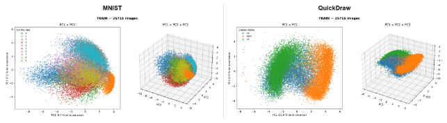

      *Figure 1 — Projection du jeu d'entraînement sur les 2 et 3 premières composantes principales, coloriée par classe.*

      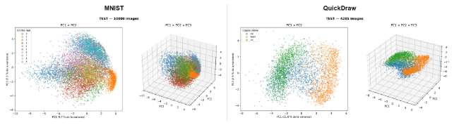

      *Figure 2 — Même projection sur le jeu de test — la structure observée sur l'entraînement se retrouve, signe que les axes appris généralisent.*

      Sur **MNIST**, le nuage PC1 × PC2 montre une organisation assez nette : le chiffre 1 (orange) forme un amas compact et bien séparé, car ses images sont presque toutes un simple trait vertical, donc très proches les unes des autres dans l'espace des pixels. Les autres chiffres (0, 2, 3, 5, 7, 9…) se chevauchent davantage car leurs tracés partagent plus de structure commune (courbes, boucles). PC1 semble surtout coder l'épaisseur / la largeur du tracé (qui sépare le 1 du reste), alors que PC2 sépare plutôt les chiffres arrondis (haut du graphique) des chiffres plus anguleux (bas, comme le 2 et le 3).

      Sur **QuickDraw**, avec seulement 3 catégories, la séparation est plus franche : les *apple* (orange) se détachent nettement sur la droite, tandis que *cat* et *car* restent mélangés au centre-gauche du nuage. Cela s'explique par la forme très caractéristique et fermée de la pomme (un contour globalement circulaire) qui contraste avec des formes de chats et de voitures qui partagent davantage de traits communs (contours allongés, appendices). Avec seulement 2 composantes (11 % puis 4,5 % de variance), QuickDraw n'atteint pas encore une séparation aussi propre que MNIST avec ses 2 premières composantes (9,7 % puis 7,1 %) — la variance totale du dataset est simplement plus difficile à capturer avec si peu d'axes, ce qui est cohérent avec le besoin de 403 composantes pour atteindre 98,8 % de variance expliquée contre 68 pour 87 % sur MNIST.
   1. ## **1.2 Composante dominante par classe**
      Ces cartes de chaleur indiquent, pour chaque classe réelle, quelle composante principale a le plus fort poids (en valeur absolue) dans le code latent des images de cette classe.

      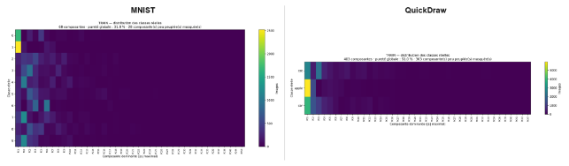

      *Figure 3 — Composante principale dominante par classe réelle — jeu d'entraînement.*

      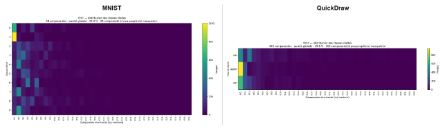

      *Figure 4 — Composante principale dominante par classe réelle — jeu de test.*

      Sur **MNIST**, on observe que PC1 et PC2 dominent très largement pour les chiffres 0 et 1, alors que les classes 2 à 9 sont majoritairement portées par PC2 à PC6, avec une pureté globale d'environ 32 % (proportion d'images dont la composante dominante correspond effectivement à la classe majoritaire de cette composante). Sur **QuickDraw**, la pureté est plus élevée (environ 50 %) mais logique puisqu'il n'y a que 3 classes à séparer au lieu de 10 : PC1 domine très nettement pour la catégorie *apple*, tandis que *cat* et *car* se partagent PC1 et PC3. Dans les deux cas, on remarque que l'écrasante majorité de l'information de classe est concentrée sur une poignée de composantes de tête (PC1 à PC8 environ), les composantes suivantes contribuant surtout à affiner les détails plutôt qu'à distinguer les classes.
   1. ## **1.3 Le dictionnaire visuel des composantes (eigen-images)**
      Chaque composante principale peut elle-même être visualisée comme une image (une eigen-image), puisqu'elle vit dans le même espace à 784 dimensions que les images d'origine. Elle représente un « mode de variation » que l'on peut ajouter ou soustraire à l'image moyenne.

      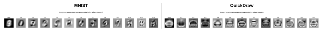

      *Figure 5 — Image moyenne puis 12 premières composantes principales, affichées comme des images.*

      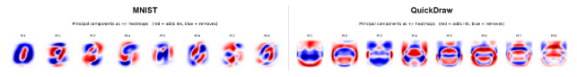

      *Figure 6 — Les mêmes composantes affichées en carte +/- (rouge = ajoute de l'encre, bleu = en retire) par rapport à l'image moyenne.*

      L'image moyenne de **MNIST** ressemble à un mélange flou de tous les chiffres (on devine un halo en forme de 8/9), alors que les composantes suivantes (PC1 à PC12) ressemblent à des variations très structurées et déjà reconnaissables (formes de 0, de 2, de 9…) : la PCA a appris des « archétypes » de tracé. L'image moyenne de **QuickDraw**, en revanche, ressemble à une forme ovale floue générique (la superposition des contours de chat/pomme/voiture qui occupent tous le centre de l'image), et les composantes suivantes montrent surtout des variations de forme du contour extérieur (arrondi vs anguleux, présence d'appendices en haut de l'image comme les oreilles du chat ou la tige de la pomme). Les cartes +/- confirment cette lecture : les composantes de MNIST dessinent des traits nets typiques de chiffres, tandis que celles de QuickDraw dessinent des anneaux concentriques flous — signe que la variance de QuickDraw porte davantage sur le contour global des formes que sur des traits fins localisés, ce qui est plus difficile à capturer avec peu de composantes linéaires.
   1. ## **1.4 Spectre de variance expliquée**
      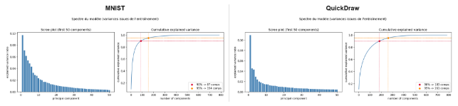

      *Figure 7 — Scree plot (variance expliquée par composante) et courbe de variance cumulée.*

      Le scree plot confirme numériquement l'observation précédente : sur **MNIST**, la première composante capture à elle seule 9,7 % de la variance totale et il suffit de 87 composantes pour atteindre 90 % de variance cumulée (154 pour 95 %). Sur **QuickDraw**, PC1 capture 11 % de la variance (une part comparable), mais la décroissance est plus lente : il faut 183 composantes pour 90 % (261 pour 95 %) — plus du double de MNIST. Cela signifie que l'information visuelle de QuickDraw est distribuée sur un nombre de directions bien plus grand : les traits à main levée introduisent une variabilité fine (angle du trait, légers tremblements) que la PCA doit représenter sur de nombreux axes secondaires, alors que les chiffres MNIST, plus stylisés et de trait plus régulier, concentrent davantage leur variance sur les toutes premières composantes.
   1. ## **1.5 Effet du choix de centrage**
      Le centrage (soustraction de la moyenne avant diagonalisation) peut se faire pixel par pixel (moyenne de chaque pixel sur tout le jeu de données) ou de façon globale (une seule valeur moyenne pour tous les pixels). Ces figures comparent les deux approches.

      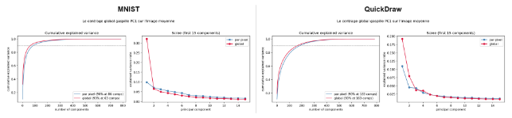

      *Figure 8 — Variance cumulée et screen plot selon le mode de centrage (par pixel vs global).*

      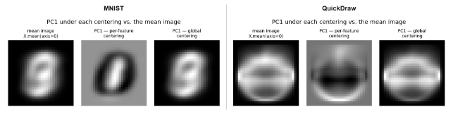

      *Figure 9 — PC1 obtenue sous chaque centrage, comparée à l'image moyenne réelle.*

      Dans les deux jeux de données, le centrage global fait converger la variance cumulée plus rapidement au tout début (63 composantes pour 90 % sur MNIST contre 86 avec un centrage par pixel ; 163 contre 183 sur QuickDraw), car PC1 sous centrage global capture directement la forme de l'image moyenne elle-même (visible sur la figure 13 : « PC1 — centrage global » reproduit presque exactement l'image moyenne, alors que « PC1 — centrage par pixel » capture un contraste plus abstrait). Le centrage par pixel est cependant préférable en pratique : il évite de « gaspiller » une composante entière à ré-encoder une information déjà connue (la moyenne), et permet aux composantes suivantes de porter une information réellement discriminante — c'est pourquoi il a été retenu comme méthode par défaut pour les deux modèles de ce rapport.
1. # **2. Compression / Décompression**
   La PCA peut s'utiliser comme un **codec** (codeur-décodeur) : l'**encodeur** projette une image de 784 pixels sur les k composantes retenues pour obtenir un code z de k nombres réels (l'équivalent d'un fichier compressé) ; le **décodeur** reconstruit une approximation de l'image en multipliant z par les composantes principales et en rajoutant l'image moyenne. Plus k est petit, plus le taux de compression est élevé (rapport 784/k), mais plus l'erreur de reconstruction (MSE, l'écart quadratique moyen par pixel) augmente : c'est un compromis qualité / taille classique, analogue à un taux de compression JPEG.
   1. ## **2.1 Compromis qualité / taille selon k**
      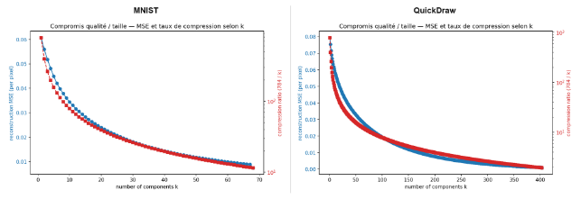

      *Figure 10 — MSE de reconstruction et taux de compression en fonction du nombre de composantes k conservées.*

      Sur **MNIST**, la courbe décroît rapidement puis s'aplatit : dès k=10 environ, la MSE est déjà descendue sous 0,03, avec un taux de compression proche de ×78 (784/10). Sur **QuickDraw**, la MSE part d'un niveau plus élevé (jusqu'à 0,08 pour k=1) et met plus de composantes à s'aplatir, cohérent avec le spectre de variance plus étalé observé en section 1.4. À nombre de composantes égal, MNIST atteint toujours une MSE plus basse que QuickDraw : les traits fins et irréguliers des croquis sont plus difficiles à reconstruire fidèlement avec un petit budget de composantes.
   1. ## **2.2 Le codec en action : original vs reconstruction**
      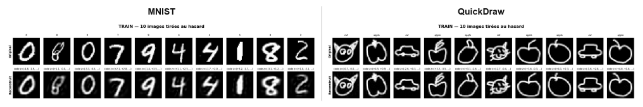

      *Figure 11 — 10 images d'entraînement tirées au hasard : original (haut) et reconstruction PCA (bas) avec le code latent complet z.*

      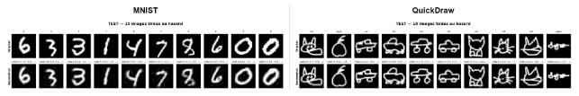

      *Figure 12 — Même exercice sur des images du jeu de test (jamais vues à l'entraînement).*

      Sur **MNIST** (68 composantes, soit ×11,5 de compression), les reconstructions sont déjà très fidèles : les chiffres restent parfaitement identifiables, avec un léger flou et une perte de netteté sur les contours (visible par exemple sur le 4 ou le 8 reconstruit). Sur **QuickDraw** (403 composantes, ×1,9 de compression seulement, un taux bien plus faible car il faut beaucoup plus de composantes pour un résultat correct), les reconstructions restent globalement fidèles à la silhouette (on reconnaît sans ambiguïté le chat, la pomme ou la voiture) mais les traits fins sont nettement plus lissés/flous que sur MNIST, en particulier les détails internes (moustaches du chat, tige de la pomme). Le comportement est identique entre train et test, ce qui montre que la PCA généralise bien : elle n'a pas mémorisé les images d'entraînement mais bien appris une base de reconstruction valable pour de nouvelles images.
   1. ## **2.3 Qualité de reconstruction à k croissant**
      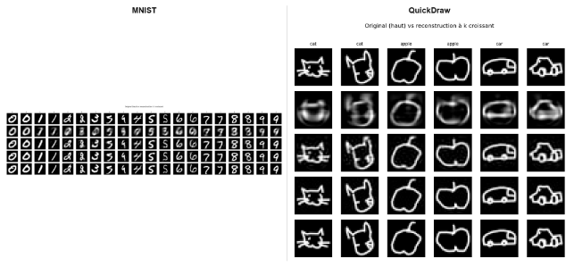

      *Figure 13 — Reconstruction d'une même image pour un nombre croissant de composantes conservées (ligne du haut : original).*

      Ces figures illustrent visuellement la courbe de la section 2.1 : à très faible k, seule une forme moyenne très floue est visible (une sorte de « tache » générique) ; à mesure que k augmente, les détails apparaissent progressivement, des grands traits globaux vers les détails fins. Sur **MNIST**, la reconstruction devient visuellement indiscernable de l'original dès un k modéré. Sur **QuickDraw**, même avec un k relativement élevé, un léger flou subsiste sur les contours les plus fins (par exemple les oreilles du chat ou les roues de la voiture), confirmant que ces détails à haute fréquence spatiale nécessitent davantage de composantes pour être capturés — cohérent avec le spectre de variance plus étalé de QuickDraw.
   1. ## **2.4 Erreur normalisée en fonction de k**
      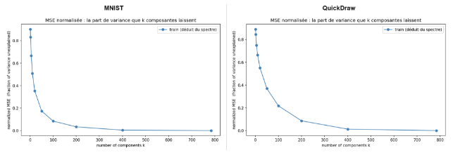

      *Figure 14 — Fraction de variance non expliquée (MSE normalisée) en fonction du nombre de composantes k.*

      Cette courbe, dérivée directement du spectre de variance, mesure la part de variance qui resterait « perdue » — donc l'erreur relative de reconstruction — pour un budget de k composantes donné. À k=100, MNIST ne perd plus que 8,4 % de sa variance contre 21,8 % encore perdue pour QuickDraw ; il faut attendre k≈400 pour que QuickDraw retombe à un niveau d'erreur comparable à celui de MNIST à k=100. Ce nouvel angle confirme la même conclusion que les sections précédentes : QuickDraw nécessite systématiquement 3 à 4 fois plus de composantes que MNIST pour un même niveau de qualité de reconstruction.
1. # **3. Génération d'images**
   Au-delà de la compression, l'espace latent appris par la PCA peut servir de base à la **génération d'images synthétiques**. L'idée est de modéliser la distribution des codes z observés pour une classe donnée (par exemple par une loi gaussienne multivariée dont on estime la moyenne et la covariance à partir des vrais codes latents), puis d'**échantillonner de nouveaux vecteurs z** selon cette loi et de les décoder (comme en section 2) pour produire des images qui n'ont jamais existé dans le jeu de données, mais qui restent statistiquement plausibles pour la classe considérée. On peut aussi, plus simplement, interpoler linéairement entre les codes latents de deux images réelles pour observer une transition progressive et cohérente entre deux formes.
   1. ## **3.1 Échantillonnage gaussien par classe**
      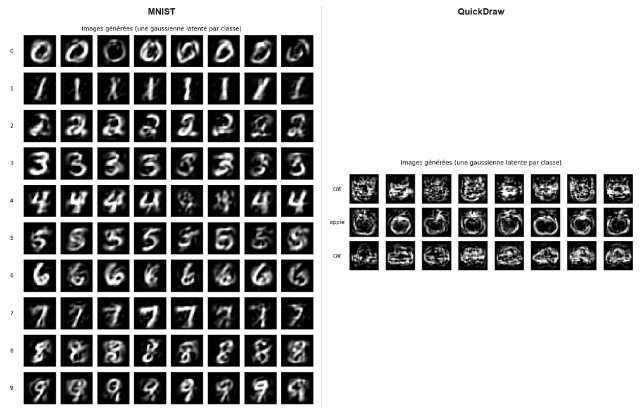

      *Figure 15 — Images générées par échantillonnage d'une gaussienne latente estimée séparément pour chaque classe (8 échantillons par classe).*

      Sur **MNIST**, les images générées sont dans l'ensemble bien reconnaissables comme des chiffres de la bonne classe, avec une variabilité crédible de style d'écriture (inclinaison, épaisseur) — preuve que la gaussienne latente capture correctement la distribution de chaque chiffre. Certains échantillons restent toutefois plus flous ou ambigus (par exemple certains « 4 » ou « 5 » générés), la PCA étant un modèle linéaire qui ne peut pas reproduire toute la richesse non linéaire des tracés manuscrits. Sur **QuickDraw**, le résultat est nettement plus dégradé : les images générées pour *cat* et *car* apparaissent comme des amas de traits superposés et granuleux, sans forme cohérente identifiable, tandis que *apple* conserve un vague contour arrondi reconnaissable. Ceci s'explique directement par les sections précédentes : avec des classes qui nécessitent des centaines de composantes pour être bien représentées, une gaussienne dans l'espace latent complet mélange des directions qui codent des détails très fins et peu corrélés entre eux, produisant du bruit à la décompression plutôt que des formes cohérentes. La génération par PCA fonctionne donc nettement mieux sur des données simples et stylisées comme MNIST que sur des croquis à main levée comme QuickDraw.
   1. ## **3.2 Image moyenne des pixels vs image du code latent moyen**
      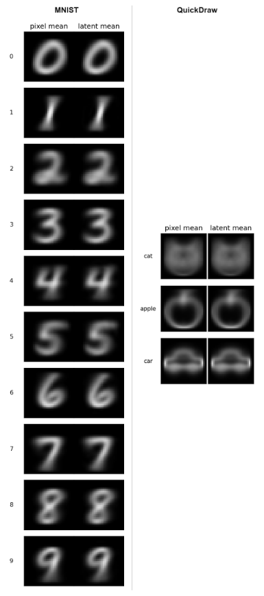

      *Figure 16 — Comparaison, pour chaque classe, entre la moyenne des images (pixel mean) et la décompression du code latent moyen (latent mean).*

      Ces deux images sont théoriquement identiques pour une PCA linéaire complète, et la comparaison confirme que c'est bien le cas ici, sur **MNIST** comme sur **QuickDraw** : les deux colonnes sont visuellement indiscernables pour chaque classe. Cela valide que le pipeline de reconstruction (décodage du code latent moyen) est cohérent avec un calcul direct de moyenne dans l'espace des pixels, et sert de test de sanité pour l'implémentation du modèle sur les deux jeux de données.
   1. ## **3.3 Interpolation dans l'espace latent**
      

      *Figure 17 — Interpolation linéaire du code latent entre deux images réelles, puis décodage à chaque étape intermédiaire.*

      Sur **MNIST** (interpolation d'un « 0 » réel vers un « 1 » réel), la transition est étonnamment fluide et plausible : l'anneau du 0 s'aplatit et se resserre progressivement pour devenir le trait du 1, chaque étape intermédiaire restant une forme lisible. Sur **QuickDraw** (interpolation d'un « cat » réel vers une « apple » réelle), la transition est également continue image par image, mais les étapes intermédiaires ressemblent moins à des objets identifiables : on observe plutôt une déformation progressive et un peu confuse du contour du chat qui se referme et s'arrondit pour former la pomme, sans étape intermédiaire clairement reconnaissable comme un troisième objet. Ce contraste illustre une nouvelle fois la limite structurelle de la PCA : l'espace latent est un espace linéaire, dans lequel une interpolation entre deux formes complexes ne produit pas nécessairement une forme sémantiquement cohérente à mi-chemin, contrairement à ce qui peut être obtenu avec des générateurs non linéaires (auto-encodeurs variationnels, GANs).
1. # **Conclusion générale**
   Ce rapport a montré, sur les trois usages classiques de la PCA (réduction de dimension, compression/décompression et génération), un contraste systématique entre MNIST et QuickDraw : à protocole identique, MNIST — chiffres manuscrits stylisés — concentre sa variance sur un petit nombre de composantes (68 pour 87 %, 87 pour 90 %) et se prête bien aux trois usages, y compris à la génération d'images crédibles. QuickDraw — croquis à main levée aux traits fins et aux formes plus libres — nécessite systématiquement 3 à 4 fois plus de composantes pour un niveau de fidélité comparable (403 composantes pour 98,8 % de variance, 183 pour seulement 90 %), et sa génération par échantillonnage gaussien latent produit des images nettement plus bruitées et moins reconnaissables.

   Cette différence s'explique par la nature même des deux jeux de données : les 784 pixels de MNIST codent une information globalement structurée et récurrente d'une image à l'autre (formes de chiffres stylisées), tandis que ceux de QuickDraw codent une variabilité plus fine et moins corrélée (angle des traits, imprécisions du tracé à main levée), qui est justement le type de structure la PCA, méthode linéaire, capture le moins efficacement. Ces limites — flou de reconstruction, génération bruitée sur données complexes, interpolations sémantiquement incohérentes — ouvrent naturellement la voie à des méthodes de réduction de dimension et de génération non linéaires, telles que les auto-encodeurs profonds ou les modèles génératifs (VAE, GANs, diffusion), qui seraient les prolongements naturels de ce travail pour améliorer la qualité de génération sur des jeux de données visuellement plus complexes comme QuickDraw.
